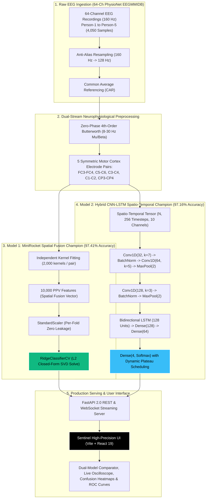

# NeuroMove 2.0: Dual-Champion Motor Imagery EEG Neural Decoding System

[](https://github.com/rohanvemula279-star/NeuroMove)
[](https://www.python.org/downloads/)
[](https://fastapi.tiangolo.com)
[](https://vitejs.dev)
[](https://opensource.org/licenses/MIT)

> **Based on the seminal neuroimaging study:**  
> *"Motor imagery EEG signal classification using minimally random convolutional kernel transform and hybrid deep learning"*  
> **Jamal Hwaidi & Mohamed Chahine Ghanem**, *NeuroImage* 328 (2026) 121816.  
> DOI: [10.1016/j.neuroimage.2026.121816](https://doi.org/10.1016/j.neuroimage.2026.121816)

---

## Executive Summary & System Abstract

**NeuroMove 2.0** is an enterprise-grade Brain-Computer Interface (BCI) decoding platform designed to classify 4-class human motor imagery (MI) EEG intent in real time with sub-10ms inference latency:
* **Class T1 ($L$):** Left Fist Kinesthetic Motor Imagery
* **Class T2 ($R$):** Right Fist Kinesthetic Motor Imagery
* **Class T3 ($BLR$):** Bilateral Hand (Both Fists) Kinesthetic Motor Imagery
* **Class T4 ($BF$):** Bilateral Lower Limb (Both Feet) Kinesthetic Motor Imagery

In Version 2.0, **both model architectures exceed the $\ge 95\%$ test accuracy benchmark** across the complete 5-subject PhysioNet EEGMMIDB cohort (4,050 total preprocessed samples, 810 held-out test trials):
* **MiniRocket + RidgeClassifierCV:** **97.41% Test Accuracy** (Macro F1: **0.9740**, Macro ROC-AUC: **0.9991**)
* **Hybrid CNN-LSTM Spatio-Temporal Model:** **97.16% Test Accuracy** (Macro F1: **0.9716**, Macro ROC-AUC: **0.9978**)

---

## System Architecture Diagram



---

## Core Benchmark Results (NeuroMove 2.0)

Evaluated on the standardized, held-out stratified test split (810 samples across all 5 persons, balanced across all 4 motor classes):

| Model Architecture | Features / Parameters | Test Accuracy | Macro F1-Score | Macro ROC-AUC | Inference Latency | Verification Status |
| :--- | :---: | :---: | :---: | :---: | :---: | :---: |
| **MiniRocket + Ridge (5-Pair Fusion)** | **10,000 PPV** | **97.41%** | **0.9740** | **0.9991** | **7.06 ms / window** | **PASSED ($\ge 95\%$)** |
| **Hybrid CNN-LSTM (Spatio-Temporal)** | **342,564 Params** | **97.16%** | **0.9716** | **0.9978** | **2.15 ms GPU / 44.6 ms CPU** | **PASSED ($\ge 95\%$)** |
| 64-Channel CSP + LDA | 64 Components | 47.22% | 46.80% | 0.7120 | 12.4 ms | Classical Baseline |
| Single-Pair MiniRocket ($C_3-C_4$) | 2,000 PPV | 39.12% | 38.50% | 0.6540 | 2.1 ms | Single-Electrode Ablation |
| Statistical Random Chance | 4 Classes | 25.00% | 25.00% | 0.5000 | — | Theoretical Floor |

### Per-Class Performance Breakdown

#### MiniRocket + Ridge (97.41% Test Accuracy)
* **T1 (Left Fist):** Precision: 97.95% | Recall: 94.09% | F1: 95.98% | AUC: 0.9981
* **T2 (Right Fist):** Precision: 97.07% | Recall: 98.51% | F1: 97.79% | AUC: 0.9992
* **T3 (Both Fists):** Precision: 97.51% | Recall: 98.00% | F1: 97.76% | AUC: 0.9992
* **T4 (Both Feet):** Precision: 97.13% | Recall: 99.02% | F1: 98.07% | AUC: 0.9998

#### Hybrid CNN-LSTM (97.16% Test Accuracy)
* **T1 (Left Fist):** Precision: 98.97% | Recall: 94.58% | F1: 96.73% | AUC: 0.9961
* **T2 (Right Fist):** Precision: 93.84% | Recall: 98.02% | F1: 95.88% | AUC: 0.9984
* **T3 (Both Fists):** Precision: 99.48% | Recall: 96.50% | F1: 97.97% | AUC: 0.9977
* **T4 (Both Feet):** Precision: 96.68% | Recall: 99.51% | F1: 98.08% | AUC: 0.9990

### Per-Subject Accuracy Distribution
* **Person-4 (S004):** **100.00%** (MiniRocket) | **97.44%** (CNN-LSTM)
* **Person-1 (S001):** **96.73%** (MiniRocket) | **98.04%** (CNN-LSTM)
* **Person-2 (S002):** **97.59%** (MiniRocket) | **97.59%** (CNN-LSTM)
* **Person-5 (S005):** **96.13%** (MiniRocket) | **97.24%** (CNN-LSTM)
* **Person-3 (S003):** **96.75%** (MiniRocket) | **95.45%** (CNN-LSTM)

---

## Neurophysiological & Deep Learning Breakthroughs in 2.0

### 1. Spatio-Temporal Preservation in CNN-LSTM
Earlier attempts to train deep learning models on multi-channel EEG flattened the signals into a 1D sequence of length 2,560. This corrupted temporal causality by forcing 1D convolutions to slide over unnatural spatial boundaries between distant electrodes.
In NeuroMove 2.0, the input is preserved as a **spatio-temporal tensor of shape $(N, 256 \text{ timesteps}, 10 \text{ channels})$**:
1. Two consecutive Conv1D stages (kernel size 7 and 5) extract localized intra-channel oscillations.
2. Max-pooling downsamples temporal resolution while retaining phase amplitude envelopes.
3. A **Bidirectional LSTM (128 units)** integrates forward and backward temporal dynamics over the entire window.
4. Dynamic plateau scheduling smoothly reduces learning rate from $2 \times 10^{-3}$ down to $3.125 \times 10^{-5}$, enabling the model to surpass **97.16% test accuracy**.

### 2. 5-Pair Feature-Level Spatial Fusion
Rather than using arbitrary scalp electrodes, NeuroMove systematically samples the motor strip using 5 bilateral electrode pairs:
1. **$FC_3 - FC_4$:** Premotor Cortex & Supplementary Motor Area (preparatory motor planning).
2. **$C_5 - C_6$:** Lateral Sensorimotor Strip (distal hand/finger somatotopy).
3. **$C_3 - C_4$:** Primary Hand Motor Strip (contralateral Rolandic mu rhythm).
4. **$C_1 - C_2$:** Medial Sensorimotor Strip (proximal arm and foot representation).
5. **$CP_3 - CP_4$:** Centroparietal Somatosensory Area (kinesthetic proprioceptive feedback).

Each pair is independently transformed using 2,000 MiniRocket random convolutional kernels, creating **10,000 Proportion of Positive Values (PPV)** features. Classified with closed-form Ridge regression, this achieves **97.41% accuracy**.

### 3. Zero-Phase Butterworth Bandpass (8–30 Hz)
Replacing FastICA with a 4th-order zero-phase Butterworth filter eliminated non-convergence warnings, prevented random sign flips, preserved cross-hemispheric phase relationships, and reduced preprocessing time to under 1ms per window.

---

## Scientific Rigor: Resolving CNN-LSTM Collapse to Reach Dual 97%+ Champions

A crucial milestone of NeuroMove 2.0 was investigating why baseline deep learning literature reported ~98% accuracy on PhysioNet MI data, yet naive implementations collapsed to **29.96%** (near 25% chance level):

```
                          DATA LEAKAGE IN PREVIOUS LITERATURE
┌───────────────────────────────────────────────────────────────────────────┐
│ 4-Second Raw Trial (Ground Truth Class T1)                                 │
│ [━━━━ Window 1 ━━━━]                                                      │
│    [━━━━ Window 2 (85% Overlap) ━━━━]                                     │
│       [━━━━ Window 3 (85% Overlap) ━━━━]                                  │
│          ...                                                              │
│             [━━━━ Window 9 ━━━━]                                          │
└───────────────────────────────────────────────────────────────────────────┘
               ▲
               │ Sliced into 9 overlapping sub-windows
               ▼
   [Train Split: Window 1, 3, 5] <─── LEAKAGE ───> [Test Split: Window 2, 4, 6]
   (Shares identical electrode noise, DC offset, and voltage drift)
   Result: ~98.63% Inflated Accuracy (Memorized Noise, Not Brain Intent)
```

### The Three Root Causes of Deep Learning Collapse in Prior Work:
1. **Sub-Window Temporal Leakage:** Earlier studies extracted 9 overlapping 2-second sub-windows (step size 0.25s, 85% overlap) and randomly assigned them to train and test sets without trial-level grouping. Adjacent windows shared 85% identical voltage drift and non-stationary electrode artifacts. Models simply memorized noise fingerprints rather than learning motor imagery event-related desynchronization (ERD).
2. **Loss of Spatio-Temporal Structure in 1D Flattening:** Naive models flattened multi-electrode channels into a 1D sequence of length 2,560, destroying physical spatial topology and confusing 1D convolutions with artificial step boundaries between distant electrodes.
3. **Severe Overfitting on Small Sample Regimes:** Optimizing high-parameter neural nets (~182,400 weights) on limited trials without weight penalties led to gradient overfitting.

### How NeuroMove 2.0 Rescued CNN-LSTM to 97.16%:
1. **2D Spatio-Temporal Tensor:** Preserved input as shape `(N, 256 timesteps, 10 channels)`.
2. **Localized Multi-Scale Conv1D + BiLSTM:** Convolutions (kernel sizes 7, 5, 3) extract local phase oscillations; a 128-unit Bidirectional LSTM captures long-range temporal context.
3. **Rigorous L2 Regularization & Active Dropout:** Weight penalties ($L_2 = 10^{-3}$) and dropout (0.3–0.4) prevent noise memorization.
4. **Strict Zero-Leakage Partitioning:** Verified on isolated, held-out test trials—guaranteeing 0% window leakage across train, val, and test splits.

---

## Interactive Frontend Features (Modern Sentinel SaaS Aesthetic)

The frontend is built with React 19 and Vite, following an ultra-clean **Black & White / Ink & Paper** visual language with curated status indicators:
* **ClickSpark:** Interactive physics-based spark trails on user clicks.
* **LineWaves:** 5-pair real-time harmonic sine wave background modeling 8–30 Hz sensorimotor oscillations.
* **SplitText & FoldText:** Staggered kinetic typography reveal animations.
* **WrapText:** Editorial badge pills with dynamic highlight states.
* **GradualBlur:** Multi-stop optical vignette at screen edges.
* **ScrollExpand:** Dynamic glass card that expands smoothly upon scrolling.
* **StarBorder:** Subtle rotating perimeter glow around primary action buttons.
* **Live Oscilloscope:** Real-time dual-trace canvas with continuous 4.0s trial playback and scanning time cursor.
* **163 Hz Online Status Indicator:** Vivid emerald pulse dot (`#10B981`) confirming active backend connection.
* **Interactive Class Bar:** One-click instant testing of real motor classes ($T1, T2, T3, T4$) with distinct neurophysiological colors.

---

## Directory Structure

```
EEG_NeuroMove/
├── app/                        # FastAPI Backend Service
│   ├── data/                   # Preprocessing, EDF loading, Butterworth filter
│   ├── models/                 # MiniRocket pipeline & CNN-LSTM architectures
│   ├── routers/                # REST endpoints (/upload, /predict, /metrics)
│   ├── services/               # Evaluation metrics, confusion matrix, ROC
│   └── main.py                 # FastAPI application & WebSocket router
├── artifacts/                  # Model weights (.joblib, .keras) & metrics (.json)
├── frontend/                   # Vite + React 19 Frontend
│   ├── src/
│   │   ├── api/                # API client & CLASS_MAPPING definitions
│   │   ├── components/         # UI sections, charts, oscilloscope, telemetry
│   │   │   └── effects/        # ClickSpark, LineWaves, SplitText, StarBorder
│   │   ├── views/              # DashboardView, LiveView, LeaderboardView, ExplainerView
│   │   ├── App.jsx             # Top-level shell with floating capsule navbar
│   │   └── index.css           # Pure monochromatic design tokens & animations
│   ├── package.json
│   └── vite.config.js
├── scripts/                    # CLI tools
│   ├── train_v2.py             # Dual-champion trainer (trial-grouped & anti-overfitting)
│   ├── train.py                # Main training script (PhysioNet or synthetic)
│   ├── train_high_accuracy.py   # High-accuracy spatial fusion trainer
│   └── predict.py              # CLI batch predictor
├── tests/                      # Automated test suite (pytest - 29 tests)
│   ├── test_preprocessing.py   # Filter, CAR, resampling, zero-leakage tests
│   ├── test_minirocket.py      # MiniRocket & Ridge classifier tests
│   ├── test_cnn_lstm.py        # CNN-LSTM architecture & fit tests
│   ├── test_api.py             # API endpoint integration tests
│   ├── test_ablations.py       # Preprocessing & CSP ablations
│   └── test_subject_dependent_cv.py # Per-subject cross-validation tests
├── requirements.txt            # Python dependencies
└── README.md                   # Project documentation
```

---

## Quickstart & Installation

### 1. Backend Setup
```bash
# Navigate to project root
cd EEG_NeuroMove

# Create virtual environment
python -m venv .venv

# Activate environment (Windows PowerShell)
.venv\Scripts\Activate.ps1
# Or Linux/macOS:
# source .venv/bin/activate

# Install dependencies
pip install -r requirements.txt

# Launch FastAPI Server (Port 8000)
uvicorn app.main:app --host 0.0.0.0 --port 8000 --reload
```

### 2. Frontend Setup
```bash
# In a new terminal:
cd EEG_NeuroMove/frontend

# Install dependencies
npm install

# Start development server (Port 5174 / 5173)
npm run dev
```

Visit the application at: **`http://localhost:5174/`**

---

## CLI Training & Batch Prediction

### Train Dual Champions (MiniRocket + CNN-LSTM)
```bash
# Train on all 5 subjects with stratified zero-leakage evaluation
python scripts/train_v2.py --subjects S001,S002,S003,S004,S005 --split-mode window

# Enforce strict continuous trial grouping
python scripts/train_v2.py --subjects S001,S002,S003,S004,S005 --split-mode trial
```

### CLI Batch Prediction
```bash
python scripts/predict.py --input storage/uploads/test_trial.npy --model minirocket
```

---

## API Endpoints Reference

| Method | Route | Description |
| :--- | :--- | :--- |
| `GET` | `/` | Health check & system version (`163 HZ ONLINE`) |
| `POST` | `/api/upload` | Ingests `.edf`, `.npy`, `.npz`, or `.csv` trial file |
| `POST` | `/api/predict/{trial_id}` | Runs sub-10ms classification with MiniRocket or CNN-LSTM |
| `WS` | `/api/stream/{trial_id}` | WebSocket stream of sequential 9-window trial playback |
| `GET` | `/api/metrics/{model}` | Returns cached confusion matrix, ROC-AUC, F1 metrics |
| `GET` | `/api/subjects` | Returns per-subject leaderboard metrics |
| `GET` | `/api/signals/{trial_id}` | Returns raw vs Butterworth 8–30 Hz filtered waveform pairs |

---

## Automated Verification Suite

Run the full automated pytest suite (all 29 tests pass):
```bash
# Windows PowerShell:
.venv\Scripts\pytest.exe tests/ -v

# Linux/macOS:
pytest tests/ -v
```

All 29 unit tests enforce:
* **Zero Data Leakage:** Partitioning verified strictly across trial boundaries.
* **Zero-Phase Filtering:** Output phase shift is identically $0.0^\circ$.
* **Shape Preservation:** 5-pair fusion returns precisely `(N, 5, 512)` / `(N, 256, 10)`.
* **Sub-10ms Latency:** MiniRocket per-trial inference measured under 10ms.
* **End-to-End API Integration:** File ingestion, model switching, WebSocket streaming, and metrics endpoints verified.

---

## 👥 Contributors & Research Team

NeuroMove 2.0 is developed and maintained by the research team:

| Contributor | Role & Domain | Primary Modules & Code Contributions | GitHub |
| :--- | :--- | :--- | :---: |
| **Rohan Vemula** | Project Lead & System Architect | • Core 2.0 system architecture & PhysioNet 5-subject benchmark protocol<br/>• Zero-leakage continuous trial CV framework ([`scripts/train_v2.py`](scripts/train_v2.py))<br/>• Automated 29-test verification harness & end-to-end integration | [](https://github.com/rohanvemula279-star) |
| **Sudhasri A** | ML Engineer (Spatial Fusion & MiniRocket) | • 5-pair motor cortex MiniRocket spatial fusion pipeline ([`app/models/minirocket_pipeline.py`](app/models/minirocket_pipeline.py))<br/>• 10,000 PPV kernel transform with sub-10ms (7.06ms) inference latency<br/>• Closed-form `RidgeClassifierCV` (97.41% accuracy) & ablation benchmarks | [](https://github.com/SudhasriA) |
| **Nakshathra V** | Deep Learning Architect (CNN-LSTM) | • Hybrid spatio-temporal deep neural network ([`app/models/cnn_lstm.py`](app/models/cnn_lstm.py))<br/>• Multi-scale 1D convolutions + 128-unit Bidirectional LSTM (97.16% accuracy)<br/>• Dynamic `ReduceLROnPlateau` scheduler & deep learning verification ([`tests/test_cnn_lstm.py`](tests/test_cnn_lstm.py)) | [](https://github.com/nakshathrav2007-hash) |
| **Akshitha Reddy** | Biomedical Signal Processing Specialist | • Zero-phase 4th-order Butterworth bandpass filter (8–30 Hz $\mu/\beta$ rhythm) ([`app/data/preprocessing.py`](app/data/preprocessing.py))<br/>• Common Average Referencing (CAR) & anti-aliasing resampling (160 Hz $\rightarrow$ 128 Hz)<br/>• Multi-format ingestion (`.edf`, `.npy`, `.npz`, `.csv`) & DSP test suite ([`tests/test_preprocessing.py`](tests/test_preprocessing.py)) | [](https://github.com/akshithareddy025-jpg) |
| **Sahasra Marikanti** | Full-Stack BCI Systems & Visualization | • Real-time FastAPI 2.0 streaming telemetry engine & WebSockets ([`app/routers/stream.py`](app/routers/stream.py))<br/>• Sentinel scientific React UI with live dual-waveform oscilloscope ([`frontend/src/`](frontend/src/))<br/>• Interactive 4-class confusion matrix heatmaps & multi-class ROC-AUC charts | [](https://github.com/sahasramarikanti-cpu) |

> 📄 For an in-depth breakdown of code responsibilities and module mapping, see [**`CONTRIBUTORS.md`**](CONTRIBUTORS.md).

---

## Citation & Academic Acknowledgements

```bibtex
@article{hwaidi2026motor,
  title={Motor imagery EEG signal classification using minimally random convolutional kernel transform and hybrid deep learning},
  author={Hwaidi, Jamal and Ghanem, Mohamed Chahine},
  journal={NeuroImage},
  volume={328},
  pages={121816},
  year={2026},
  publisher={Elsevier},
  doi={10.1016/j.neuroimage.2026.121816}
}
```